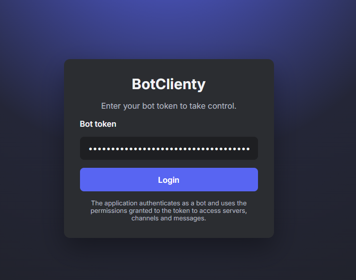

<div align="center">

<!-- =====================  HERO  ===================== -->

<!-- Animated Gradient Title with Logo -->

<svg width="100%" height="140" viewBox="0 0 1200 140" xmlns="http://www.w3.org/2000/svg" role="img" aria-label="BotClienty">
  <defs>
    <linearGradient id="grad" x1="0%" y1="0%" x2="100%" y2="0%">
      <stop offset="0%" stop-color="#7C3AED">
        <animate attributeName="offset" values="0;1;0" dur="8s" repeatCount="indefinite"/>
      </stop>
      <stop offset="50%" stop-color="#5865F2">
        <animate attributeName="offset" values="0.5;1;0.5" dur="8s" repeatCount="indefinite"/>
      </stop>
      <stop offset="100%" stop-color="#06B6D4">
        <animate attributeName="offset" values="1;0;1" dur="8s" repeatCount="indefinite"/>
      </stop>
    </linearGradient>
    <filter id="glow" x="-50%" y="-50%" width="200%" height="200%">
      <feGaussianBlur stdDeviation="6" result="blur"/>
      <feMerge>
        <feMergeNode in="blur"/>
        <feMergeNode in="SourceGraphic"/>
      </feMerge>
    </filter>
  </defs>
  <!-- Logo Image -->
  <image x="480" y="20" width="48" height="48" href="./app/logo.webp" opacity="0.9">
    <animate attributeName="opacity" values="0.7;1;0.7" dur="3s" repeatCount="indefinite"/>
  </image>
  <text x="50%" y="60%" text-anchor="middle" font-family="Inter, system-ui, -apple-system, 'Segoe UI', sans-serif" font-size="64" font-weight="800" fill="url(#grad)" filter="url(#glow)">BotClienty</text>
  <text x="50%" y="92%" text-anchor="middle" font-family="Inter, system-ui, -apple-system, 'Segoe UI', sans-serif" font-size="18" fill="#b5bac1">Modern web client for Discord bots</text>
</svg>

<!-- Tech badges -->

<p>
  
  
  
  
</p>

<!-- Animated Divider -->

<svg width="100%" height="24" viewBox="0 0 1200 24" xmlns="http://www.w3.org/2000/svg" aria-hidden="true">
  <defs>
    <linearGradient id="wave" x1="0" y1="0" x2="1" y2="0">
      <stop offset="0%" stop-color="#7C3AED"/>
      <stop offset="50%" stop-color="#5865F2"/>
      <stop offset="100%" stop-color="#06B6D4"/>
    </linearGradient>
  </defs>
  <path d="M0,12 C150,2 250,22 400,12 C550,2 650,22 800,12 C950,2 1050,22 1200,12" fill="none" stroke="url(#wave)" stroke-width="3" stroke-linecap="round">
    <animate attributeName="d" dur="6s" repeatCount="indefinite" values="
      M0,12 C150,2 250,22 400,12 C550,2 650,22 800,12 C950,2 1050,22 1200,12;
      M0,12 C150,22 250,2 400,12 C550,22 650,2 800,12 C950,22 1050,2 1200,12;
      M0,12 C150,2 250,22 400,12 C550,2 650,22 800,12 C950,2 1050,22 1200,12
    "/>
  </path>
</svg>

<p><em>Conecte-se com o token do seu bot, navegue por servidores/canais, visualize mensagens (embeds e anexos) e envie mensagens numa UI limpa, inspirada no Discord.</em></p>

</div>

---

## ✨ Destaques

<div align="center">

<table>
  <tr>
    <td align="center" width="33%">
      <!-- Icon: Shield -->
      <svg width="48" height="48" viewBox="0 0 24 24" fill="none" aria-hidden="true">
        <path d="M12 2l7 4v6c0 5-3.5 9-7 10-3.5-1-7-5-7-10V6l7-4z" stroke="#7C3AED" stroke-width="1.6" fill="rgba(124,58,237,0.08)"/>
      </svg>
      <br/>
      <b>Autenticação segura</b><br/>
      Conecte com o token do bot sem terceirizar dados.
    </td>
    <td align="center" width="33%">
      <!-- Icon: Bolt -->
      <svg width="48" height="48" viewBox="0 0 24 24" fill="none" aria-hidden="true">
        <path d="M13 2L3 14h7l-1 8 10-12h-7l1-8z" stroke="#5865F2" stroke-width="1.6" fill="rgba(88,101,242,0.10)"/>
      </svg>
      <br/>
      <b>Tempo real</b><br/>
      Mensagens e envios com atualização instantânea.
    </td>
    <td align="center" width="33%">
      <!-- Icon: Layers -->
      <svg width="48" height="48" viewBox="0 0 24 24" fill="none" aria-hidden="true">
        <path d="M12 3l9 5-9 5-9-5 9-5zm0 8l9 5-9 5-9-5 9-5z" stroke="#06B6D4" stroke-width="1.6" fill="rgba(6,182,212,0.10)"/>
      </svg>
      <br/>
      <b>UI inspirada no Discord</b><br/>
      Layout dark, responsivo e moderno.
    </td>
  </tr>
</table>

</div>

### 🌟 Principais capacidades

```ts
🔐 Autenticação por Token  → Conecta com segurança ao seu bot
📱 Layout Responsivo       → Desktop / Tablet / Mobile
🎨 Visual Moderno          → Tema escuro refinado
⚡ Atualização em tempo real→ Visualize e envie mensagens
🖼️ Suporte rico            → Embeds, anexos e mídia
🚀 Performance Next.js     → Build otimizado e export estático
```

---

## 🎬 Preview

<details>
<summary><b>🔑 Login</b> – autenticação limpa e objetiva</summary>

> Insira o token do bot e prossiga.  



</details>

<details>
<summary><b>💬 Chat</b> – servidores, canais e mensagens</summary>

> Navegue pela guild tree, visualize embeds e anexos em tempo real. 

</details>

<details>
<summary><b>📱 Responsivo</b> – perfeito em qualquer tela</summary>

> UI adaptativa com tipografia e espaçamentos consistentes. 

</details>

---

## 🚀 Quick Start

```bash
# Node.js 18+
node --version  # 18.x ou superior
npm --version   # 8.x ou superior
```

```bash
# 1️⃣ Clone
git clone https://github.com/amathyzinn/botclienty.git
cd botclienty

# 2️⃣ Dependências
npm install

# 3️⃣ Dev server
npm run dev

# 4️⃣ Abra o navegador
# http://localhost:3000
```

### 🏗️ Build de produção

```bash
npm run build
# artefatos em ./out prontos para hosting estático
```

---

## 📖 Guia de Uso

1. Acesse o <a href="https://discord.com/developers/applications">Discord Developer Portal</a>.
2. Crie um app ou selecione um existente.
3. Vá em <b>Bot</b> e gere/recupere o token.
4. <b>⚠️ Não compartilhe o token publicamente.</b>

```ts
// Fluxo de uso
// 1) Informe o token no login
// 2) Explore servidores e canais acessíveis
// 3) Selecione um canal para ler
// 4) Envie mensagens
// 5) Veja embeds, anexos e mídia
```

---

## 🛠️ Tech Stack

<p align="center">
  
  
  
  
  
</p>

---

## 📁 Estrutura do Projeto

```
botclienty/
├── app/                 # Next.js App Router
│   ├── globals.css      # Estilos globais & tema
│   ├── layout.tsx       # Root layout
│   └── page.tsx         # Página principal
├── .history/            # Histórico (auto)
├── next.config.js       # Config Next.js
├── package.json         # Scripts e deps
├── tsconfig.json        # Config TS
└── README.md            # Este arquivo
```

---

## 🎨 Design System

### 🎭 Cores (tokens)

```css
:root {
  --primary-bg: #1e1f22;      /* background principal */
  --secondary-bg: #2b2d31;    /* cards/painéis */
  --accent-blue: #5865f2;     /* Discord blue */
  --accent-purple: #7c3aed;   /* Glow roxo */
  --accent-cyan: #06b6d4;     /* Realce ciano */
  --text-primary: #f2f3f5;    /* texto principal */
  --text-secondary: #b5bac1;  /* texto secundário */
  --hover-bg: #404249;        /* hover */
  --border-color: #1e1f22;    /* bordas */
  --error-color: #f23f43;     /* erros */
}
```

### 🔤 Tipografia

```css
font-family: 'Inter', system-ui, -apple-system, BlinkMacSystemFont, 'Segoe UI', sans-serif;
/* Hierarquia */
h1: 1.8rem;  /* Títulos de página */
h2: 1.1rem;  /* Seções */
body: 1rem;  /* Corpo */
small: 0.8rem; /* Suporte */
```

---

## 🔒 Segurança & Privacidade

* ✅ Tokens armazenados localmente, sem terceiros.
* ✅ Todas as chamadas usam HTTPS.
* ✅ Sem coleta de dados externos.
* ✅ Os dados permanecem no seu dispositivo.

---

## 🧩 Personalização (Temas)

> Sugestão de snippets para variações visuais simples no Frontend.

```tsx
// theme.ts
export const theme = {
  brand: {
    gradient: 'linear-gradient(90deg,#7C3AED,#5865F2,#06B6D4)',
    glow: '0 0 24px rgba(124,58,237,0.35)',
  },
  radii: { card: 12, pill: 999 },
  gaps: { xs: 6, sm: 10, md: 16, lg: 24 },
};
```

```tsx
// components/GlowCard.tsx
export function GlowCard({ children }: { children: React.ReactNode }) {
  return (
    <div
      style={{
        background: 'var(--secondary-bg)',
        borderRadius: 12,
        boxShadow: '0 0 0 1px rgba(255,255,255,0.04), 0 10px 30px rgba(124,58,237,0.12)',
        padding: 16,
      }}
    >
      {children}
    </div>
  );
}
```

---

## 🤝 Contribuição

Relate bugs e sugira features via Issues. Pull Requests são bem-vindos!

```bash
# Flow sugerido
# 1) Fork
# 2) Branch de feature
git checkout -b feature/sua-feature
# 3) Commits descritivos
git commit -m "feat: adiciona sua feature"
# 4) Push & PR
```

---

## 📄 Licença

MIT — veja <a href="./LICENSE">LICENSE</a>.

---

<div align="center">

<!-- Star Me callout with subtle animation -->

<svg width="100%" height="90" viewBox="0 0 1200 90" xmlns="http://www.w3.org/2000/svg" role="img" aria-label="Star this project">
  <defs>
    <radialGradient id="pulse" cx="50%" cy="50%" r="50%">
      <stop offset="0%" stop-color="rgba(124,58,237,0.35)"/>
      <stop offset="100%" stop-color="rgba(124,58,237,0)"/>
    </radialGradient>
  </defs>
  <circle cx="600" cy="45" r="22" fill="url(#pulse)">
    <animate attributeName="r" values="18;26;18" dur="2.6s" repeatCount="indefinite"/>
    <animate attributeName="opacity" values="0.6;0.2;0.6" dur="2.6s" repeatCount="indefinite"/>
  </circle>
  <text x="50%" y="55" text-anchor="middle" font-family="Inter, system-ui, -apple-system, 'Segoe UI', sans-serif" font-size="18" fill="#f2f3f5">⭐ Curtiu? Dê uma estrela!</text>
</svg>

<p><sub>Feito com ❤️ para a comunidade do Discord — por <b>aMathyzin</b></sub></p>

<p>
  <a href="https://github.com/aMathyzinn">
    
  </a>
  <a href="https://amathyzin.com.br">
    
  </a>
  <a href="https://amathyzin.xyz">
    
  </a>
  <a href="https://discord.gg/XXquEjp69D">
    
  </a>
</p>

<p><a href="#-destaques">⬆️ Voltar ao topo</a></p>

</div>
